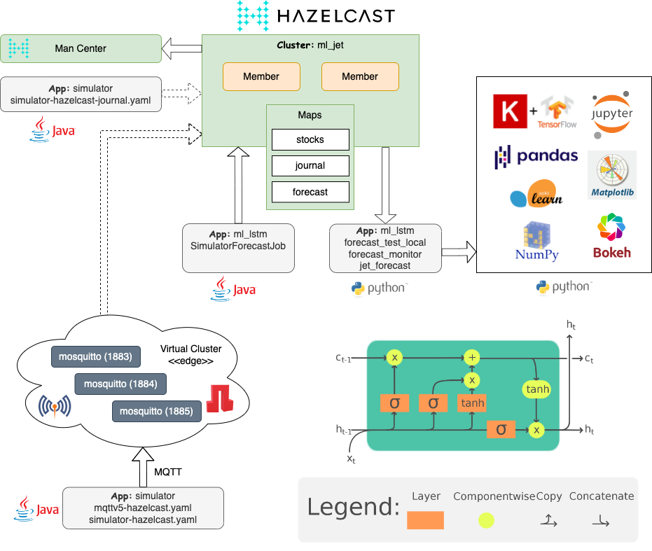

 [*PadoGrid*](https://github.com/padogrid) | [*Catalogs*](https://github.com/padogrid/catalog-bundles/blob/master/all-catalog.md) | [*Manual*](https://github.com/padogrid/padogrid/wiki) | [*FAQ*](https://github.com/padogrid/padogrid/wiki/faq) | [*Releases*](https://github.com/padogrid/padogrid/releases) | [*Templates*](https://github.com/padogrid/padogrid/wiki/Using-Bundle-Templates) | [*Pods*](https://github.com/padogrid/padogrid/wiki/Understanding-Padogrid-Pods) | [*Kubernetes*](https://github.com/padogrid/padogrid/wiki/Kubernetes) | [*Docker*](https://github.com/padogrid/padogrid/wiki/Docker) | [*Apps*](https://github.com/padogrid/padogrid/wiki/Apps) | [*Quick Start*](https://github.com/padogrid/padogrid/wiki/Quick-Start)

---

# Neural Network: LSTM RNN

This bundle demonstrates forecasting future events in real time using LSTM RNN (Long Short-Term Memory Recurrent Neural Network) via Keras backed by TensorFlow. It constructs a Hazelcast Jet pipeline to apply LSTM RNN models on streamed data.

## Installing Bundle

```bash
# --- Execute one of the following install_bundle commands:

# Download and install as a workspace
install_bundle -download -workspace bundle-hazelcast-5-app-ml_lstm-cluster-ml_jet

# Specify '-init' to automatically build the bundle environment.
# This requires Java 11 executable in your path.
install_bundle -init -checkout bundle-hazelcast-5-app-ml_lstm-cluster-ml_jet
```

## Use Case

LSTM was first introduced in 1997 by [Hochreiter & Schmidhuber](http://www.bioinf.jku.at/publications/older/2604.pdf). It is designed to avoid the long-term dependency problem in RNN by remembering information for long periods of time. It is documented by many that LSTM is being successfully applied to a wide variety of real-world use cases such as text generation, handwriting recognition/generation, music generation, languate translation, image captioning, and forecasting. A quick search on the Internet shows a wealth of articles describing how LSTM works along with Python and R tutorials [1,2]. However, they fall short on describing how it can be applied to real time data. This bundle fills that void by bringing LSTM in the data grid using Hazelcast Jet to perform stream processing and forecast data in real time.



## Google Colab

This bundle runs on Colab.

- Forecast Test: [](https://colab.research.google.com/github/padogrid/bundle-hazelcast-5-app-ml_lstm-cluster-ml_jet/blob/master/apps/ml_lstm/src/main/python/forecast_test_colab.ipynb)

## Required Software

- JDK 11+ (Required by simulator and Hazelcast Management Center)
- Python 3.10 (Tested with Anaconda on macOS and Ubuntu)
- Maven 3.x+
- Hazelcast 5.x (Full distribution of OSS or Enterprise. Slim distributions do not include Python binaries.)
- PadoGrid 0.9.28+ (Release 1.0.2+ requires PadoGrid 0.9.28+.)

## Bundle Contents

```console
apps
└── ml_lstm
    ├── bin_sh
    │   ├── build_app
    │   └── setenv.sh
    ├── etc
    │   ├── hazelcast-client.xml
    │   ├── mqttv5-hazelcast.yaml
    │   ├── prebuilt_models/
    │   ├── simulator-hazelcast-journal.yaml
    │   ├── simulator-hazelcast.yaml
    │   └── simulator-mqtt-journal.yaml
    ├── pom.xml
    └── src
        └── main
            ├── java/
            └── python/
clusters
└── ml_jet
    ├── bin_sh/
    └── etc/
```

---

## Python Installation

This bundle requires Python 3.10 due to conflicts between Python modules and Hazelcast Jet.

The following is an Anaconda example. *Note that Anaconda is NOT required to run this bundle.*

```bash
conda create --name tensorflow310 python=3.10
conda activate tensorflow310
cd_app ml_lstm
pip install -r src/main/python/requirements.txt
```

❗ For non-Anaconda environments on Debian/Ubuntu systems, you need to install the `python3-venv` package due to the Hazelcast Jet's use of a virtual environment.

```bash
sudo apt install python3.10-venv
```

❗ If you will be using the accompanied Jupyter notebooks in JupyterLab then you must **restart JupyterLab after you have installed `requrements.txt`**. This is because [HoloViews](https://holoviews.org/index.html) used by the notebooks requires Jupyter integration. If you are running this bundle in a PadoGrid container, then you can restart Jupyter Lab by stopping it as follows. The container will automatically restart JupyterLab if it is not running. Note that you may need to readjust the JupyerLab windows after a restart.

```bash
stop_jupyter
```

[Download and Install Anaconda](https://www.anaconda.com/products/individual)

---

## Implementation Notes


[*Image Courtesy of Wikipedia*](https://en.wikipedia.org/wiki/Long_short-term_memory)

This bundle uses the LSTM tutorial example provided by [1] with several key additions as follows:

- The LSTM tutorial uses `fit_transform()` for both train and test sets of data. `fit_transform()` scales data and learns the scaling parameters of that data. By applying it to the test data, the tutorial introduces bias to the test data since it is also fitting the test data [3]. Normally, we want the test data to be a completely new and a surprise set for the model. If you want to remove this bias, then instead of invoking `TemporalLstmDna.prepare_data()`, separately invoke `TemporalLstmDna.prepare_data_train()`  and `TemporalLstmDna.prepare_date_test()`. The former performs fit and transform, i.e., invokes `fit_transform()` and the latter performs transform only, i.e., invokes `transform()`. 

- To deploy and use the model against real-time data, the model and its relevant data are stored in the grid.

  - Model - the LSTM model
  - Scaler - the scaler for transforming data
  - Last observed data - the last observed data applied to the model
  - Batch size - batch size used to fit the model.
  - RT Model - the model with batch size 1 for forecasting real-time data

- The stored model is applied to the data updates to generate forecasts in real time. This is done by invoking one of the following methods:

  - **make_forecasts_with_saved_model_series()** - Forecast the specified series of observed data.
  - **make_forecasts_with_saved_model_discrete()** - Forecast the specified observed data point.

- The supervised datasets are automatically reshaped based on the specified batch size. This is an essential step as the underlying Tensorflow may fail if the batch size does not evenly fit in the supervised datasets.

  - This automation allows you to freely change the batch size without concern to shape mismatch failures. 
  - The batch size is persisted such that the existing models are reinstated seamlessly.
  - The batch size automatically resets to 1 for real-time data.

- The DNA implementation closely follows the [DNA (Data Node App)](https://github.com/netcrest/pado/tree/develop/pado-rpc) guidelines defined by [Pado](https://github.com/netcrest/pado), abeit its hardware choice is limited to the same machine as the data node imposed by the Jet RPC mechanics.

- There is room for improving performance as follows.

  - In `SimulatorForecastJob`, find a way to discard empty values after filtering from moving forward in the DAG. Some empty values are mysteriously sent to the Python handler just to get rejected.
  - Each DNA execution performs a file IO operation to read and write the target model. This is an expensive operation that can be improved by adding a caching service.

- The Python function handler was originally written with Jet 4.5, which has the following limitations that may hamper its usefulness. Its `gRPC Service` may be a better choice. (It is likely that Hazelcast Platform 5.x has inherited these limitations.)
  - The `transform_list()` function argument is always a list of strings.
  - The list argument is constructed by Jet by aggregating results from the local parallelization. If the string values contain commas, the list it creates contains mangled values that are unparsable. This prevents the use of JSON string values.
  - By design, the `transform_list()` function must always return a list with the same number of elements as the input list. Otherwise, Jet throws an exception and the results will be lost. At that point of time, the DAG position will reset to the top and continue from there.

- This bundle creates two (2) jar files: `ml-lstm-1.0.3.jar` and `ml-lstm-1.0.3-data.jar`. `ml-lstm-1.0.3.jar` contains all the classes including the job and data classes to be submitted to Jet by the user. `ml-lstm-1.0.3-data.jar` contains only data classes and is automatically deployed to the workspace by the build step in the [Preparing Environment](#preparing-environment) section..

**Binaries:**

```console
<workspace-dir>
├── apps
│   └── ml_lstm
│       └── target
│           └── ml-lstm-1.0.3.jar
├── lib
└── plugins
    └── ml-lstm-1.0.3-data.jar
```

**Source Code:**

```console
src
└── main
    ├── java
    │   └── padogrid
    │       └── bundle
    │           └── hazelcast
    │               ├── data
    │               │   ├── ForecastValue.java
    │               │   ├── ForexRecord.java
    │               │   └── PortableFactoryImpl.java
    │               └── ml
    │                   ├── FeatureAverage.java
    │                   ├── ForecastUtil.java
    │                   ├── SimulatorAccumulator.java
    │                   ├── SimulatorForecastJob.java
    │                   └── ValueWrapper.java
    └── python
        ├── padogrid
        │   └── bundle
        │       ├── dna
        │       │   ├── dna_client.py
        │       │   └── temporal_lstm_dna.py
        │       ├── hazelcast
        │       │   ├── data
        │       │   │   ├── ForecastValue.py
        │       │   │   ├── ForexRecord.py
        │       │   │   └── PortableFactoryImpl.py
        │       │   ├── dna
        │       │   │   └── hazelcast_lstm_dna.py
        │       │   └── ml
        │       │       ├── forecast_monitor.py
        │       │       ├── forecast_test_local.py
        │       │       └── jet_forecast.py
        │       └── util
        │           └── class_util.py
        └── requirements.txt
```

---

## Preparing Environment

1. Make sure you have Python installed as described in the [Python Installation](#python-installation) section.

2. Build the `ml_lstm` app environment. The `build_app` script also installs the simulator bundle, [`bundle-none-app-simulator`](https://github.com/padogrid/bundle-none-app-simulator).

✏️  If you have installed the bundle with the `install_bundle -init` option, then you can skip this step. The `install_bundle -init` command automatically invokes this script via [.init_workspace.sh](.init_workspace.sh)

```bash
cd_app ml_lstm/bin_sh
./build_app
```

3. Add Hazelcast members.

```bash
switch_cluster ml_jet
# Check to see the number of members configured for Hazelcast. You can add members
# by running 'add_member' as follows. 
show_cluster
# Add 2 members
add_member -count 2
show_cluster
```

---

## Using LSTM App

After you have gone through the [Startup Sequence](#startup-sequence) section, try your own datasets to forecast future events by following the steps provided in the link below.

[Using LSTM App](README_USING_LSTM_APP.md)

---

## Troubleshooting and Debugging 

If you encounter Hazelcast Jet issues, then refer to [`bundle-hazelcast-5-tutorial-app-jet_python`](https://github.com/padogrid/bundle-hazelcast-5-tutorial-app-jet_python), which covers Jet job submission steps in detail and provides troubleshooting tips.

To enable debugging, set `is_debug_enabled` to `True` in the `jet_forecast.py` module as follows.

```bash
cd_app ml_lstm
vi src/main/python/padogrid/bundle/hazelcast/ml/jet_forecast.py
```

In `jet_forecast.py`, set `is_debug_enabled`.

```python
...
# Set is_debug_enabled to True to enable debugging. Note that the port number
# has been hard coded to 5678. If there are more than one member running
# on the same machine then port conflicts will occur.
is_debug_enabled = True
...
```

---

## Hazelcast Jet Performance Observations

1. Connecting Management Center (MC) to Hazelcast cluster spawns an extremely large number of threads. It is typical to see 450-780 threads with MC vs. 120-128 threads without MC.
1. Hazelcast members use excessive CPUs at idle. It is typical for each member to consume 15-25% of CPU with a Python job submitted without having any activities. For our demo, no activities means that the simulator was not publishing real-time data during the idle time. This means the Python function in the Jet pipeline is never invoked at idle.
1. Canceling all jobs brings each member's CPU down to 0.2% as expected. The high number of threads, on the other hand, remains the same with MC still running.
1. Stopping MC immediately brings down the number of threads to 120-128 threads with a single Python job running and 103-113 threads without any job running.

---

## Startup Sequence

❗ If you are using Jupyter Lab or VS Code terminals, then do NOT start the cluster from there. The Jet job will terminate with the following exception otherwise.

```console
Caused by: java.io.IOException: Python process died before completing initialization
```

**You must start the cluster outside of Jupyter Lab or VS Code terminals to avoid the above exception. This seems to be a limitation of Jet.**

### 1. Start Hazelcast cluster and Management Center

 Terminal 1

```bash
# Start Hazelcast cluster and MC. ml_jet has been preconfigured with PYTHONPATH set to 
# the ml_lsmt app's Python source directory. See 'bin_sh/setenv.sh'.
switch_cluster ml_jet
start_cluster -all
show_cluster
```

### 2. Ingest simulated data into Hazelcast

The `maxCount` in the `simulator-hazelcast.yaml` file is set to ingest 2600 entries to the `stocks` map. You can change it to another value as needed.

 Terminal 1

```bash
cd_app simulator/bin_sh
./simulator -simulator-config ../etc/simulator-hazelcast.yaml
```

### 3. Build LSTM model

To run Python, you must have Python 3.10 installed along with the required modules showin in the [`requirements.txt`](apps/ml_lstm/src/main/python/requirements.txt) file. The Python package versions used to test this bundle is listed in the [`requirements-versions.txt`](apps/ml_lstm/src/main/python/requirements-versions.txt) file. In addition to the required modules, `PYTHONPATH` must include this bundle's Python source directory. It is automatically set when you ran the `build_app` script in the [Build Steps](#build-steps) section, but if you are running from a new terminal then you can set it as follows.

 Terminal 1, Terminal 2, Terminal 3

```bash
cd_app ml_lstm
export PYTHONPATH=`pwd`/src/main/python
```

🔘 Building a model takes a long time. Depending on the data volume along with the `epochs`, `neurons`, and `batch_size` values, it can take a few seconds to over an hour. This bundle includes models that have been prebuilt with `epochs=100`, `neurons=1`, and `batch_size=1`. Note that since the simulator adds randomness to jitters, tunning these parameters may not necessarily yield better outcomes, but may significantly reduce the execution time. You are encourged to try different values.

The `build_app` script that you executed in the [Preparing Environment](#preparing-environment) section has already placed the prebuilt models in the `data/ml_results` directory where the models are generated. This means you can start forecasting data without building models. You can manually copy the models as follows.

❗ CAUTION: The following will overwrite the existing models.

 Terminal 1

```bash
cd_app ml_lstm
cp -r etc/prebuilt_models/* data/ml_results/
```

🔘 To build models, run the `forecast_test_local` module with the option, `--generate`, which generates a model for the specified feature using the dataset in Hazelcast. It also validates the dataset and plots the entire set of observed data along with the predicted (forecasted) data. The following shows its usage.

 Terminal 1

```bash
cd_app ml_lstm
export PYTHONPATH=`pwd`/src/main/python
python -m padogrid.bundle.hazelcast.ml.forecast_test_local --help
```

Output:

```console
usage: forecast_test_local.py [-h] [-?] [-m MAP] [-f FEATURE] [-g] [-e EPOCHS] [-n NEURONS] [-b BATCH_SIZE]
                              [-t TEST_DATA_PERCENTAGE] [-v]

Plots observed and forecasted data for the specified Hazelcast map. It generates an LSTM model for the specified
map that contains observed data if the model is not already generated. To force generating a model, specify the
'--generate' option. It will overwrite the previously generated model.

options:
  -h, --help            show this help message and exit
  -?                    show this help message and exit (default: False)
  -m MAP, --map MAP     Hazelcast map that contains observed data (default: stocks)
  -f FEATURE, --feature FEATURE
                        Feature name (default: stock1-jitter)
  -g, --generate        Generate model. If specified then creates a new model, otherwise, uses the existing
                        model. (default: False)
  -e EPOCHS, --epochs EPOCHS
                        Number of model fit iterations (number of epochs to train the model). This option has no
                        effect for the existing model. (default: 100)
  -n NEURONS, --neurons NEURONS
                        Number of neurons in the hidden layer. This option has no effect for the existing model.
                        (default: 1)
  -b BATCH_SIZE, --batch_size BATCH_SIZE
                        Batch size. If the existing model is used, then the specified batch size is overwritten
                        with the existing model's batch size. (default: 1)
  -t TEST_DATA_PERCENTAGE, --test_data_percentage TEST_DATA_PERCENTAGE
                        Test data percentage. (default: 0.2)
  -v, --verbose         Print interim results. (default: False)
```

---

The following Jupyter notebook is equivalent to `padogrid.bundle.hazelcast.ml.forecast_test_local`.

####  Notebook: [forecast_test_local.ipynb](apps/ml_lstm/src/main/python/forecast_test_local.ipynb)

---

Try the default feature using the included models.

 Terminal 1

```bash
# Display the default feature: stock1-jitter
cd_app ml_lstm
export PYTHONPATH=`pwd`/src/main/python
python -m padogrid.bundle.hazelcast.ml.forecast_test_local
```

Try specifying a feature as follows.

```
cd_app ml_lstm
python -m padogrid.bundle.hazelcast.ml.forecast_test_local -f stock1-jitter
python -m padogrid.bundle.hazelcast.ml.forecast_test_local -f stock1-no-jitter
python -m padogrid.bundle.hazelcast.ml.forecast_test_local -f stock2-jitter
python -m padogrid.bundle.hazelcast.ml.forecast_test_local -f stock2-no-jitter
python -m padogrid.bundle.hazelcast.ml.forecast_test_local -f stock1-jitter-large
```

To view all the features, see `etc/simulator-hazelcast.yaml`. The `equationNames` attribute lists the equation names which make up the attributes (features) of JSON objects that the simulator generates.

 Terminal 1

```bash
cd_app simulator
grep equationNames etc/simulator-hazelcast.yaml 
```

Output:

```console
equationNames: [stock1-jitter, stock1-no-jitter, stock2-jitter, stock2-no-jitter, stock1-jitter-large]
```

To build a model, specity the `--generate` option as follows.

```bash
cd_app ml_lstm
python -m padogrid.bundle.hazelcast.ml.forecast_test_local -f stock1-jitter --generate
python -m padogrid.bundle.hazelcast.ml.forecast_test_local -f stock1-no-jitter --generate
python -m padogrid.bundle.hazelcast.ml.forecast_test_local -f stock2-jitter --generate
python -m padogrid.bundle.hazelcast.ml.forecast_test_local -f stock2-no-jitter --generate
python -m padogrid.bundle.hazelcast.ml.forecast_test_local -f stock1-jitter-large --generate
```


### 4. Submit jobs

Submit  `ml-lstm-1.0.3.jar` that you created during the build steps. It contains `SimulatorForecastJob` (Java) that intakes streamed data to accumulate `time` by date interval and fit the resultant average value to the model to forecast the next data point. We could simply select the last value in the data interval, but if the data interval is too large then taking the last value may significantly skew the forecast results as it continously drifts away from the dataset that the model was originally created with. The accumulator also serves our demonstration purpose for showing a glimpse of how we can aggregate streamed data.

 Terminal 1

```bash
# Make sure to first unset CLASSPATH and reset it by switching into ml_jet to prevent
# ClassNotFoundException exceptions.
export CLASSPATH=
switch_cluster ml_jet
cd_app ml_lstm
hz-cli -t ml_jet@localhost:5701 submit target/ml-lstm-1.0.3.jar --help
```

Output:

```console
usage: SimulatorForecastJob
 -?                   Print this message
 -f,--feature <arg>   Feature name. Default: stock1-jitter
 -h,--help            Print this message
 -j,--journal <arg>   Name of the journal map that streams observed
                      values. Default: journal
```

Let's submit `SimulatorForecastJob` with the default feature, `stock1-jitter`.

 Terminal 1

```bash
cd_app ml_lstm
hz-cli -t ml_jet@localhost:5701 submit target/ml-lstm-1.0.3.jar
```

The submitted job forms the following DAG.

```console
digraph DAG {
	"mapJournalSource(journal)" [localParallelism=2];
	"map" [localParallelism=16];
	"map-stateful-global" [localParallelism=1];
	"map-2" [localParallelism=16];
	"mapUsingPython" [localParallelism=1];
	"LSTM Forecast" [localParallelism=1];
	"mapJournalSource(journal)" -> "map" [queueSize=1024];
	"map" -> "map-stateful-global" [label="distributed-partitioned", queueSize=1024];
	"map-stateful-global" -> "map-2" [queueSize=1024];
	"map-2" -> "mapUsingPython" [queueSize=1024];
	"mapUsingPython" -> "LSTM Forecast" [queueSize=1024];
}
```


### 5. Ingest real-time data

The `simulator-hazelcast-journal.yaml` file is identical to `simulator-hazelcast.yaml` except that it feeds data at a slower pace into the `journal` map. The `journal` map data updates are streamed into the Jet pipeline, which in turn invokes the Python code that generates forecasted values.

 Terminal 2

```bash
cd_app simulator/bin_sh
./simulator -simulator-config ../etc/simulator-hazelcast-journal.yaml
```

### 6. Plot real-time forecasts

- `padogrid.bundle.hazelcast.ml.forecast_monitor` - This module plots forecasts and observed values as it receives them in real time.

Display the usage.

 Terminal 1

```bash 
export PYTHONPATH=`pwd`/src/main/python
python -m padogrid.bundle.hazelcast.ml.forecast_monitor --help
```

Output:

```console
usage: forecast_monitor.py [-h] [-?] [-c CLUSTER] [-m MAP] [-f FEATURE]

Forecast monitor in real time

options:
  -h, --help            show this help message and exit
  -?                    show this help message and exit (default: False)
  -c CLUSTER, --cluster CLUSTER
                        Hazelcast cluster name (default: ml_jet)
  -m MAP, --map MAP     Name of the map that streams forecasted values (default: forecast)
  -f FEATURE, --feature FEATURE
                        Feature name. The feature name is used for the chart title only. It can be any name that
                        identifies the data being displayed. (default: stock1-jitter)
```

---

The following Jupyter notebook is equivalent to `padogrid.bundle.hazelcast.ml.forecast_monitor`.

####  Notebook: [forecast_monitor.ipynb](apps/ml_lstm/src/main/python/forecast_monitor.ipynb)

---

Plot the default feature, `stock1-jitter`.

 Terminal 1

```bash
export PYTHONPATH=`pwd`/src/main/python
python -m padogrid.bundle.hazelcast.ml.forecast_monitor
```


---

## Monitoring Java and Python processes

Use `top` to monitor `java` and `python` processes as follows.

macOS:

```bash
top -pid $(pgrep -d " " "java|python" |sed "s/ / -pid /g")
```

Linux:

```bash
top -p $(pgrep -d " " "java|python" |sed "s/ / -p /g")
```

---

## Integrating MQTT Virtual Cluster

This bundle includes an MQTT virtual cluster connector for briding MQTT and Hazelcast. The included `HazelcastJsonConnector` bridges MQTT topics to Hazelcast maps by converting the topic names by replacing `/` with `_` (underscore) and supplying unique Hazelcast map keys. The map keys come in the form of sequential numbers, UUID, time, or values extracted from the JSON payloads.

To use the MQTT virtual cluster named `edge`, follow the steps below.


### 0. Install Mosquitto

✏️  If you are using a PadoGrid container, then Mosquitto has already been installed and you can skip this step.

First, install Mosquitto as described in the [Install/Building Mosquitto](https://github.com/padogrid/padogrid/wiki/Installing-Building-Mosquitto) section of the PadoGrid manual.
            
### 1. Install and start MQTT virtual cluster

 Terminal 1

```bash
# Create the default cluster, mymosquitto
make_cluster -product mosquitto

# Start the virtual cluster
start_cluster -cluster mymosquitto
```

❗ Do not switch into `mymosquitto`.  All of the subsequent Hazelcast commands must be executed in the Hazelcast cluster context, and not the Mosquitto cluster. If you are unsure, then execute the following switch command to set the Hazelcast cluster context.

```bash
# Switch into the Hazelcast cluster
switch_cluster ml_jet
```

### 2. Ingest initial data to Hazelcast cluster

 Terminal 1


```bash
switch_cluster ml_jet
cd_app simulator/bin_sh
./simulator -simulator-config ../etc/simulator-hazelcast.yaml
```

### 3. Submit job

 Terminal 1

```bash
cd_app ml_lstm
hz-cli -t ml_jet@localhost:5701 submit target/ml-lstm-1.0.3.jar
```

### 4. Start MQTT virtual cluster

 Terminal 2

```bash
cd_app ml_lstm
vc_start -config etc/mqttv5-hazelcast.yaml
```

### 5. Ingest real-time data to MQTT virtual cluster

 Terminal 3

```bash
cd_app simulator/bin_sh
./simulator -simulator-config ../etc/simulator-mqtt-journal.yaml
```

### 6. Plot real-time forecasts

 Terminal 1

```bash
cd_app ml_lstm
export PYTHONPATH=`pwd`/src/main/python
python -m padogrid.bundle.hazelcast.ml.forecast_monitor -f stock1-jitter
```

---

## Teardown

```bash
# Stop all in workspace: Hazelcast cluster, Management Center, Mosquitto
stop_workspace -all
```

---

## Tips

### 1. I'm getting the following exception when I run `hz-cli submit...`.

```console
Caused by: java.lang.ClassNotFoundException: com.hazelcast.jet.python.PythonServiceConfig
	at java.net.URLClassLoader.findClass(URLClassLoader.java:382)
	at java.lang.ClassLoader.loadClass(ClassLoader.java:418)
	at java.lang.ClassLoader.loadClass(ClassLoader.java:351)
```

#### Solution

If you see `ClassNotFoundException` then unset `CLASSPATH` and reset it by switching into the `ml_jet` cluster as follows.

```bash
export CLASSPATH=
switch_cluster ml_jet
cd_app ml_lstm
hz-cli -t ml_jet@localhost:5701 submit target/ml-lstm-1.0.3.jar
```

### 2. The charts fail to display with the following error message.

```console
...
qt.qpa.plugin: Could not load the Qt platform plugin "xcb" in "" even though it was found.
This application failed to start because no Qt platform plugin could be initialized. Reinstalling the application may fix this problem.

Available platform plugins are: eglfs, minimal, minimalegl, offscreen, vnc, webgl, xcb.
```

#### Solution

Forcifully remove all `qt` modules. This error occurs when conda enivironment is linking to its own `qt` binaries. Use the `--force` option to remove all `qt` modules without removeing their dependencies.

```bash
conda remove --force $(conda list |grep qt | awk '{print $1}')
```

### 3. I'm getting the following exception when I submit jobs.

```console
...
Caused by: java.lang.ClassNotFoundException: com.hazelcast.jet.python.PythonServiceConfig
        at java.base/java.net.URLClassLoader.findClass(URLClassLoader.java:476)
        at java.base/java.lang.ClassLoader.loadClass(ClassLoader.java:594)
        at java.base/java.net.FactoryURLClassLoader.loadClass(URLClassLoader.java:904)
        at java.base/java.lang.ClassLoader.loadClass(ClassLoader.java:527)
...
```

#### Solution

This occurs when you have a *slim* version of Hazelcast. Install a full version by running `install_padogrid` as follows.

```bash
install_padogrid -product hazelcast-oss
update_products -product hazelcast-oss
```

Make sure to restart the Hazelcast cluster after installation.

```bash
kill_cluster -all
start_cluster -all
```

### 4. How do I execute SQL in Magement Center?

Before you can execute SQL statements to query JSON objects from Management Center, you must first creat a mapping map. There are two types of mapping map for JSON: `json-flat` and `json`. Execute one of them followed by your query statmement.

- `json-flat`

```sql
CREATE OR REPLACE MAPPING stocks (
    __key VARCHAR,
    stock1-jitter DOUBLE,
    stock1-jitter-large DOUBLE,
    stock1-no-jitter DOUBLE,
    stock2-jitter DOUBLE,
    stock2-no-jitter DOUBLE
)
type IMap OPTIONS('keyFormat'='varchar', 'valueFormat'='json-flat');
```

- `json`

```sql
CREATE OR REPLACE MAPPING stocks
TYPE IMap
OPTIONS (
    'keyFormat' = 'varchar',
    'valueFormat' = 'json'
)
```

### 5. How do I setup VS Code with PadoGrid?

1. Create a Python environment with all the required packages installed. An example conda environment is described in the [Python Installation](#python-installation) section. From VS Code, select the Python environment by searching **Python: Select Interpreter** (*Shift-Commond-P*).

2. Make sure the `jq` executable is installed and is in the path. The `jq` binary is downlodable from the following link.

  https://stedolan.github.io/jq/download/ 

3. Install this bundle using either `bundle_install -init -checkout` or `bundle_install -init -workspace -download`. These commands will create a new workspace and trigger the included `.init_workspace.sh` script which automatically intializes VS Code with the PadoGrid workspace environment.

4. Open VS Code using the PadoGrid's `open_vscode` command.

```bash
switch_workspace bundle-hazelcast-5-app-ml_lstm-cluster-ml_jet
open_vscode
```

#### Notes:

The `open_vscode` command generates the `workspace.code-workspace` file in the workspace directory. You can edit that file and reconfigure VS Code as needed. For example, the `.init_workspace.sh` script adds the `PYTHONPATH` entry as follows.

```bash
switch_workspace bundle-hazelcast-5-app-ml_lstm-cluster-ml_jet
vi workspace.code-workspace
```

`PYTHONPATH` is set in the `workspace.code-workspace` file:

```json
{
  "settings": {
    "terminal.integrated.defaultProfile.osx": "bash",
    "terminal.integrated.profiles.osx": {
      "bash": {
        "path": "bash",
        "args": [
          "--init-file",
          "<workspace-dir>/.vscode/workspace_vscode.sh"
        ]
      }
    },
    "terminal.integrated.defaultProfile.linux": "bash",
    "terminal.integrated.profiles.linux": {
      "bash": {
        "path": "bash",
        "args": [
          "--init-file",
          "<workspace-dir>/.vscode/workspace_vscode.sh"
        ]
      }
    },
    "terminal.integrated.env.osx": {
      "PYTHONPATH": "apps/ml_lstm/src/main/python"
    },
    "terminal.integrated.env.linux": {
      "PYTHONPATH": "apps/ml_lstm/src/main/python"
    }
  },
  ...
}
```

To run Python code in the debugger, the `.init_workspace.sh` script also creates the `.env` file in the Padogrid workspace directory as follows.

```bash
switch_workspace bundle-hazelcast-5-app-ml_lstm-cluster-ml_jet
cat .env
```

`PYTHONPATH` is set in the `.env` file:

```properties
PYTHONPATH=$PADOGRID_WORKSPACES_HOME/bundle-hazelcast-5-app-ml_lstm-cluster-ml_jet/apps/ml_lstm/src/main/python
```

---

## References
1. [Time Series LSTM](https://machinelearningmastery.com/multi-step-time-series-forecasting-long-short-term-memory-networks-python/) - Describes multi-step LSTM (Long Short-Term Memory) Networks.
1. [Beginner’s Guide to RNN & LSTMs](https://medium.com/@humble_bee/rnn-recurrent-neural-networks-lstm-842ba7205bbf) - Describes RNN and LSTM in simple language.
1. [Understanding LSTMs](https://colah.github.io/posts/2015-08-Understanding-LSTMs/) - Provides a high level overview of LSTM.
1. [What and why behind fit_transform() and transform() in scikit-learn!](https://towardsdatascience.com/what-and-why-behind-fit-transform-vs-transform-in-scikit-learn-78f915cf96fe) - Explains why we use `fit_transform()` on training data but `transform()` on the test data.
1. [FOREX_eurusd-minute-High, OpenML](https://www.openml.org/d/41845) - Historical price data of the FOREX EUR/USD from Dukascopy (2018-01-01 to 2018-12-13). Each row represents one candlesitck of one minute. This is for a future reference. Its dataset cannot be used with this bundle at this time.
1. [Data Feed Simulator](https://github.com/padogrid/bundle-none-app-simulator), PadoGrid Bundles.
1. [Installing and Running VS Code in PadoGrid](https://github.com/padogrid/padogrid/wiki/VS-Code), PadoGrid Manual.
1. [Hazelcast Job: Executing Remote Python Code](https://github.com/padogrid/bundle-hazelcast-5-tutorial-app-jet_python), PadoGrid Bundles.
1. [Running Bundles in Container](https://github.com/padogrid/padogrid/wiki/Running-Bundles-in-Container), PadoGrid Manual.
1. [How do I install Miniconda3 in PadoGrid environment?](https://github.com/padogrid/padogrid/wiki/faq-How-do-I-install-Miniconda3-in-PadoGrid-environment), PadoGrid FAQ.

---

 [*PadoGrid*](https://github.com/padogrid) | [*Catalogs*](https://github.com/padogrid/catalog-bundles/blob/master/all-catalog.md) | [*Manual*](https://github.com/padogrid/padogrid/wiki) | [*FAQ*](https://github.com/padogrid/padogrid/wiki/faq) | [*Releases*](https://github.com/padogrid/padogrid/releases) | [*Templates*](https://github.com/padogrid/padogrid/wiki/Using-Bundle-Templates) | [*Pods*](https://github.com/padogrid/padogrid/wiki/Understanding-Padogrid-Pods) | [*Kubernetes*](https://github.com/padogrid/padogrid/wiki/Kubernetes) | [*Docker*](https://github.com/padogrid/padogrid/wiki/Docker) | [*Apps*](https://github.com/padogrid/padogrid/wiki/Apps) | [*Quick Start*](https://github.com/padogrid/padogrid/wiki/Quick-Start)
